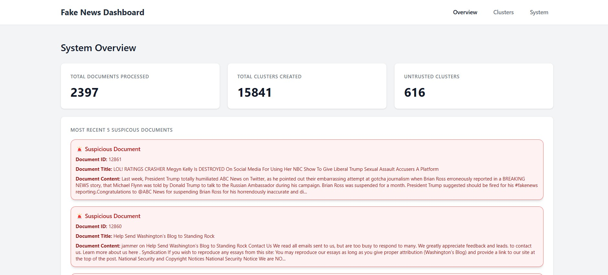

# 486-final-project

### 1) Install Dependencies
```bash
pip install -r requirments.txt
```

### 2) Download Universal Sentence Encoder Model
```bash
mkdir use_model  # Create a folder for the model
wget https://tfhub.dev/google/universal-sentence-encoder/4?tf-hub-format=compressed -O use_model.tar.gz
# Extract, move `archive` into the `use_model` directory
```

### 3) Download Dataset
```bash
mkdir data  # Create a folder for the data
```
- Download the file ```WELFake_Dataset.csv``` from [Kaggle](https://www.kaggle.com/datasets/saurabhshahane/fake-news-classification?resource=download).
- Within the CSV, add the feature label ```doc_id``` first on the first line. It should read ```doc_id,title,text,label```.
- Run ```python3 flip_labels.py``` to keep real/fake indexing consistent with the system.

### 4) Train Naive Bayes Model
Run
```bash
python3 train_naive_bayes.py
```
before doing anything further.

### 5) RabbitMQ on Docker
Run the following commands to create a rabbitMQ container

```bash
docker pull rabbitmq:3
docker run -d --name rabbitmq -p 5672:5672 rabbitmq:3
```

### 6) Running the backend
Open terminal and run the following command from the root directory

```bash
python3 backend.py
```

### 7) Running Consumer Endpoints
Open terminal and run the following command from the root directory

``` bash
python3 Consumer.py
```
### 8) Running Consumer Endpoints





- Ensure you have RabbitMQ running via Docker or on system.
- Run the following commands in seperate terminal instances:

``` bash
python3 backend.py # runs the backend or api endpoint
python3 Consumer.py # runs the consumer service which ingests data from the queue

# wait for Consumer to start before running the following command - will see a Consumer Starting print in terminal

npm run dev # runs the frontend

```

Now, send POST requests to the folowing api with a document or documents in the following form:
```bash

{ 
    document_id: 'str'
    title: 'str'
    content: 'str'

}
```